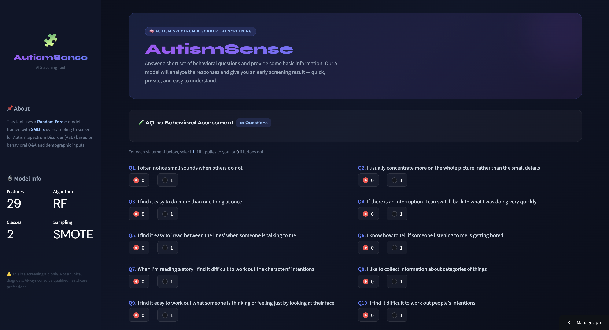

# 🧩 Autism Spectrum Disorder (ASD) Predictor

> **Best Model:** Random Forest + SMOTE · Test Accuracy: 98.1% · F1 Score: 0.957

## What This Project Is About :-

Autism Spectrum Disorder affects millions of people worldwide, but getting a proper diagnosis takes months — sometimes years. Early screening can make a massive difference. I built this project to explore whether machine learning can help identify ASD risk from a short behavioral questionnaire and basic demographic info.

The dataset has 800 samples with AQ-10 behavioral scores, age, gender, ethnicity, jaundice history, family autism history, and more. The target is binary — ASD or not.

# Image


[


## The Real Journey — What Actually Happened

### Step 1 — Data Cleaning & EDA

The data came with several issues I had to deal with before touching any model:

- `age_desc` column had the same value for every row — dropped it
- `ID` column was just an index — dropped it  
- `age` was float — converted to int
- `ethnicity` and `relation` had `?` appearing 40+ times — replaced with `'Others'`
- Country values had inconsistencies (`Hong Kong` → `China`, `Viet Nam` → `VietNam`)
- **Class imbalance**: 639 non-ASD vs 161 ASD — this was the core problem

EDA showed age is right-skewed with 39 outliers. The `result` feature is left-skewed. A6_Score was also skewed toward 0. Target class was heavily imbalanced — 80% vs 20% split.

### Step 2 — Tried Every Model I Could Think Of

I ran **6 different models** before SMOTE. None of them performed well on the minority class (ASD = 1):

| Model | Test Accuracy | Recall (ASD) | F1 |
|-------|-------------|-------------|-----|
| Logistic Regression | 87.5% | 69.5% | 0.713 |
| KNN (k=7) | 81.1% | 44.1% | 0.510 |
| Naive Bayes | 80.3% | 88.1% | 0.667 |
| Decision Tree | 85.6% | 64.4% | 0.667 |
| Random Forest | 87.1% | 59.3% | 0.673 |
| AdaBoost | 88.3% | 76.3% | 0.744 |
| Gradient Boost | 85.6% | 62.7% | 0.661 |
| XGBoost | 86.0% | 61.0% | 0.661 |

The accuracy numbers looked decent, but recall on the ASD class was the real problem. Missing an actual ASD case (false negative) is far worse than a false positive in a medical screening context — and all models were struggling there.

### Step 3 — Hyperparameter Tuning (Still Not Enough)

I ran GridSearchCV on both XGBoost and Random Forest:

**XGBoost best params:** `learning_rate=0.1, max_depth=3, n_estimators=50, subsample=0.8`  
**Best Recall (CV):** 62.8%

**Random Forest best params:** `max_depth=7, min_samples_leaf=2, min_samples_split=2, n_estimators=100`  
**Best Recall (CV):** 60.9%

Tuning helped a little, but the fundamental problem was the class imbalance. No amount of hyperparameter tuning fixes a model that's never seen enough examples of the minority class.

### Step 4 — SMOTE Changed Everything

Applied SMOTE (Synthetic Minority Over-sampling Technique) with `k_neighbors=3` on the training set only:

- Before SMOTE: Class 0 → 434, Class 1 → 102
- After SMOTE: Class 0 → 511, Class 1 → **511** ✓

Then re-ran Random Forest and XGBoost on the balanced data:

**XGBoost + SMOTE:**
- Test Accuracy: 94.7%
- Recall: 91.5%
- F1: 0.885

**Random Forest + SMOTE (Final Model):**
- Test Accuracy: **98.1%**
- Recall: **94.9%**
- F1: **0.957**
- Confusion Matrix: `[[203, 2], [3, 56]]` — only 5 mistakes on 264 test samples

Also re-ran GridSearchCV on SMOTE data:  
**Best RF params after SMOTE:** `max_depth=7, min_samples_leaf=1, min_samples_split=2, n_estimators=100`  
**Best Recall (CV):** **95.3%** 🎯

The final saved model is the `rf_smote` (Random Forest trained on SMOTE-balanced data).

---

## Final Results

```
rf_smote Testing Accuracy   : 0.9811
rf_smote Training Accuracy  : 0.9608
rf_smote Precision (Test)   : 0.9655
rf_smote Precision (Train)  : 0.8584
rf_smote Recall (Test)      : 0.9492
rf_smote Recall (Train)     : 0.9510
rf_smote F1 Score (Test)    : 0.9573

Confusion Matrix (Test):
[[203   2]
 [  3  56]]

Confusion Matrix (Train):
[[418  16]
 [  5  97]]
```

---

## Project Structure

```
├── Autism_predictor.ipynb     # Full notebook — cleaning, EDA, 8 models, SMOTE, tuning
├── train.csv                  # Dataset (800 samples, 22 features)
├── rf_smote_model.pkl         # Final saved model
├── app.py                     # Streamlit UI for predictions
├── Dashboard.png              # ScreenShot of UI
├── requirements.txt           # All Library that used
└── README.md
```

---

## Features Used

| Feature | Type | Description |
|---------|------|-------------|
| A1–A10 Score | Binary (0/1) | AQ-10 behavioral questionnaire responses |
| age | Integer | Age of the individual |
| gender | Categorical | Male / Female |
| ethnicity | Categorical | Ethnic background |
| jaundice | Binary | Born with jaundice (yes/no) |
| austim | Binary | Family member with autism (yes/no) |
| used_app_before | Binary | Used screening app before |
| relation | Categorical | Who filled the form (Self/Parent/etc.) |
| result | Float | AQ-10 composite score |

---

## Tech Stack

- Python
- Pandas, NumPy — data cleaning & EDA
- Matplotlib, Seaborn — visualization
- Scikit-learn — all ML models, GridSearchCV, metrics
- XGBoost — gradient boosting
- imbalanced-learn — SMOTE oversampling
- Pickle — model serialization
- Streamlit — deployment UI

---

## How to Run
[](https://autismprediction-by-sourabh.streamlit.app/)


---

## What I Learned

The biggest takeaway from this project is that **accuracy is a misleading metric on imbalanced datasets**. Logistic Regression had 87.5% accuracy but was missing 30% of actual ASD cases. That's not acceptable in a medical context.

SMOTE was the turning point — not because it's magic, but because it gave every model an equal chance to learn both classes. The same Random Forest that gave 59% recall before SMOTE jumped to 95% recall after.

The second lesson: **always apply SMOTE after the train-test split**, never before. Applying it before would leak synthetic minority samples into the test set and give you artificially inflated results.

---

## Author

Made by **Sourabh Vishwakarma** 
- [LinkedIn](www.linkedin.com/in/sourabh9098) 
- [GitHub](https://github.com/yourusername)
- [Email](www.sourabh555@gmail.com)
